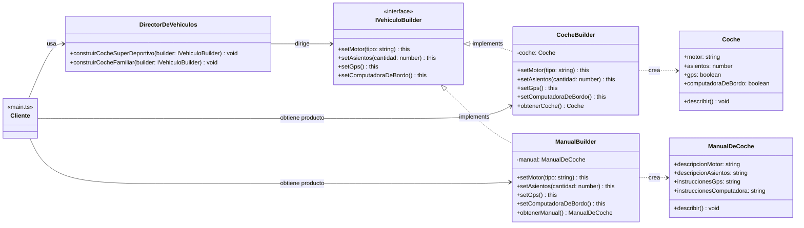

# Builder Pattern — TypeScript

Implementación del patrón de diseño creacional **Builder** en TypeScript, enfocado en la fabricación de autos junto con la generación de sus respectivos manuales de usuario.

---

## ¿Qué es el patrón Builder?

Builder es un patrón de diseño **creacional** que permite construir objetos complejos paso a paso. Separa la lógica de construcción del objeto de su representación final, permitiendo que el mismo proceso de construcción pueda crear productos completamente diferentes.

### ¿Qué problema resuelve?

Cuando una clase tiene muchos parámetros opcionales, se cae en la trampa del **constructor telescópico**: un constructor que crece indefinidamente con cada nueva característica opcional, obligando a pasar múltiples valores nulos o booleanos confusos.

```typescript
// ❌ Sin Builder: constructor monstruoso lleno de nulos y booleanos difíciles de leer
const coche = new Coche("V8 Turbo 600cv", 2, true, true, null, false);

// ✅ Con Builder: se configuran solo los pasos necesarios mediante un lenguaje fluido
const coche = new CocheBuilder()
  .setMotor("V8 Turbo 600cv")
  .setAsientos(2)
  .setGps()
  .setComputadoraDeBordo()
  .obtenerCoche();
```

---

## Diagrama UML



---

## Estructura del proyecto

```
autos/
├── IVehiculoBuilder.ts      # Interfaz Builder     — el "contrato" común
├── Coche.ts                 # Producto A           — el coche físico
├── ManualDeCoche.ts         # Producto B           — el manual de usuario
├── CocheBuilder.ts          # Builder Concreto A   — ensambla el coche
├── ManualBuilder.ts         # Builder Concreto B   — redacta el manual
└── DirectorDeVehiculos.ts   # Director             — el "capataz de la obra"
main.ts                      # Cliente              — orquesta todo
```

---

## Participantes del patrón

### `IVehiculoBuilder` — Interfaz Builder

Es el **idioma común** que todos los builders deben hablar. Sin esta interfaz, cada builder tendría métodos con nombres y firmas distintas, y el Director no podría dirigirlos de forma genérica.

Define cuatro pasos de construcción, todos con retorno `this` para habilitar el encadenamiento de métodos:

```typescript
export interface IVehiculoBuilder {
  setMotor(tipo: string): this;
  setAsientos(cantidad: number): this;
  setGps(): this;
  setComputadoraDeBordo(): this;
}
```

> **Nota sobre `this` como tipo de retorno:** permite encadenar llamadas de forma fluida:
> `builder.setMotor("V8").setAsientos(2).setGps()`
> en lugar de escribir cada llamada en una línea separada.

---

### `Coche` — Producto A

El objeto complejo que se quiere construir. La clase `Coche` por sí sola no sabe cómo ensamblarse — eso es responsabilidad del Builder. Aquí solo se declaran qué partes tiene un coche terminado.

```typescript
export class Coche {
  motor: string = "";
  asientos: number = 0;
  gps: boolean = false;
  computadoraDeBordo: boolean = false;
}
```

Un `Coche` recién creado está "en blanco". El Builder irá llenando estas propiedades una a una según lo que indique el Director.

---

### `ManualDeCoche` — Producto B

Un manual de papel no tiene **nada** que ver con un coche de metal. No heredan de la misma clase ni implementan la misma interfaz. Son estructuralmente distintos:

| `Coche`             | `ManualDeCoche`            |
|---------------------|----------------------------|
| `motor: string`     | `descripcionMotor: string` |
| `asientos: number`  | `descripcionAsientos: string` |
| `gps: boolean`      | `instruccionesGps: string` |
| `computadoraDeBordo: boolean` | `instruccionesComputadora: string` |

Y sin embargo, el Director los construye con los **mismos pasos**. Esto demuestra que el patrón Builder separa la secuencia de construcción del resultado concreto.

---

### `CocheBuilder` — Builder Concreto A

Implementa cada paso de `IVehiculoBuilder` y traduce cada instrucción en ensamblaje físico:

```
setMotor("V8 Turbo")     →  coche.motor = "V8 Turbo"
setAsientos(2)           →  coche.asientos = 2
setGps()                 →  coche.gps = true
setComputadoraDeBordo()  →  coche.computadoraDeBordo = true
```

El coche en construcción vive privado dentro del builder. El cliente y el Director nunca acceden a él directamente mientras se ensambla — esto garantiza que nadie recibe un coche a medio construir.

El método `obtenerCoche()` **no forma parte de `IVehiculoBuilder`** — es exclusivo de esta clase. Por eso el cliente debe llamarlo directamente aquí, y no a través del Director. Tras entregar el coche, el builder se reinicia y queda listo para reutilizar.

---

### `ManualBuilder` — Builder Concreto B

Implementa los mismos 4 pasos que `CocheBuilder`, pero en lugar de ensamblar piezas físicas, redacta documentación:

```
setMotor("V8 Turbo")     →  "Instrucciones de mantenimiento para motor V8 Turbo"
setAsientos(2)           →  "Guía de ajuste para 2 asientos"
setGps()                 →  "Cómo configurar y usar el GPS integrado"
setComputadoraDeBordo()  →  "Panel de control: funciones y alertas"
```

El Director llama a `setMotor("V8 Turbo")` sin saber cuál de los dos builders tiene enfrente. Eso es **polimorfismo aplicado al patrón Builder**.

---

### `DirectorDeVehiculos` — Director

Encapsula las "recetas" de construcción: sabe **qué pasos ejecutar** y **en qué orden** para producir un tipo de vehículo determinado.

**Lo que el Director NO sabe:**
- Si está construyendo un coche físico o un manual de papel
- Con qué materiales trabaja el builder
- Qué tipo de objeto quedará al final

**Lo que el Director SÍ sabe:**
- Que el builder habla el "idioma" `IVehiculoBuilder`
- Qué pasos componen cada receta
- El orden correcto de esos pasos

```typescript
// Receta 1: Super Deportivo — 4 pasos
construirCocheSuperDeportivo(builder: IVehiculoBuilder): void {
  builder.setMotor("V8 Turbo 600cv").setAsientos(2).setGps().setComputadoraDeBordo();
}

// Receta 2: Familiar — 3 pasos (sin computadora de a bordo)
construirCocheFamiliar(builder: IVehiculoBuilder): void {
  builder.setMotor("1.6 TDI Eco").setAsientos(5).setGps();
}
```

> El patrón Builder elimina los "parámetros fantasma" que plagan a los constructores telescópicos tradicionales. Si el Director no llama a `setComputadoraDeBordo()`, simplemente no se incluye — sin `null`, sin `false`, sin flags.

---

### `main.ts` — Cliente

El cliente tiene exactamente **3 responsabilidades**:

1. Crear el builder concreto que necesita
2. *(Opcional)* Pasárselo al Director para que ejecute una receta
3. Recoger el producto terminado del builder

**Lo que el cliente NUNCA hace:**
- Construir el objeto directamente (no llama a `new Coche()` con 10 parámetros)
- Conocer el orden interno de los pasos de construcción
- Pedirle el producto al Director (el Director no lo tiene)

---

## Flujo completo

```typescript
const director = new DirectorDeVehiculos();
const cocheBuilder  = new CocheBuilder();
const manualBuilder = new ManualBuilder();

// El Director ejecuta la misma receta sobre dos builders distintos
director.construirCocheSuperDeportivo(cocheBuilder);   // produce metal
director.construirCocheSuperDeportivo(manualBuilder);  // produce papel

// El cliente recoge el resultado de cada builder directamente
const cocheDeportivo  = cocheBuilder.obtenerCoche();
const manualDeportivo = manualBuilder.obtenerManual();
```

> **¿Por qué el cliente no le pide el producto al Director?**
> Porque `IVehiculoBuilder` no tiene ningún método `obtener`. El Director no sabe qué tipo de objeto acaba de construir — podría ser un coche, un manual, o cualquier otra cosa. Esta separación es intencional y es el corazón del patrón.

---

## Construcción sin Director

El cliente también puede controlar cada paso sin pasar por el Director. Útil cuando se necesita una configuración única que no corresponde a ninguna receta estándar. El encadenamiento con `return this` hace el código muy legible:

```typescript
const cocheCustom = new CocheBuilder()
  .setMotor("Eléctrico 300kW")
  .setAsientos(4)
  .setGps()
  // No se activa setComputadoraDeBordo → simplemente no se incluye
  .obtenerCoche();
```

---

## Salida esperada

```
==================================================
EJEMPLO: BUILDER DE AUTOS Y MANUAL
==================================================

--- Super Deportivo ---
🚗 Coche ensamblado:
   Motor              : V8 Turbo 600cv
   Asientos           : 2
   GPS                : Sí
   Computadora a bordo: Sí

📖 Manual generado:
   Motor    : Instrucciones de mantenimiento para motor "V8 Turbo 600cv"
   Asientos : Guía de ajuste para 2 asientos
   GPS      : Cómo configurar y usar el GPS integrado
   Compu.   : Panel de control: funciones y alertas

--- Coche Familiar ---
🚗 Coche ensamblado:
   Motor              : 1.6 TDI Eco
   Asientos           : 5
   GPS                : Sí
   Computadora a bordo: No

--- Configuración personalizada (sin Director) ---
🚗 Coche ensamblado:
   Motor              : Eléctrico 300kW
   Asientos           : 4
   GPS                : Sí
   Computadora a bordo: No
```

---

## Puntos clave del patrón

| Concepto | Descripción |
|---|---|
| **Separación de responsabilidades** | El Director sabe el orden de los pasos; el Builder sabe cómo ejecutarlos |
| **Polimorfismo** | El mismo Director produce un coche o un manual sin cambiar una sola línea |
| **Sin parámetros fantasma** | Los pasos opcionales simplemente no se llaman — sin `null`, sin `false` |
| **Integridad del producto** | El objeto en construcción vive privado en el builder hasta que esté completo |
| **Reutilización** | El builder se reinicia tras entregar el producto, listo para la próxima construcción |

---

## Fuente

El concepto, la estructura y el pseudocódigo de este patrón están basados en:

> **Refactoring.Guru — Builder Pattern**
> https://refactoring.guru/design-patterns/builder

El ejemplo de autos y manuales de usuario utilizado en este repositorio proviene directamente del pseudocódigo oficial del sitio, adaptado e implementado en TypeScript con comentarios extendidos para facilitar la comprensión durante la exposición.